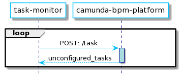
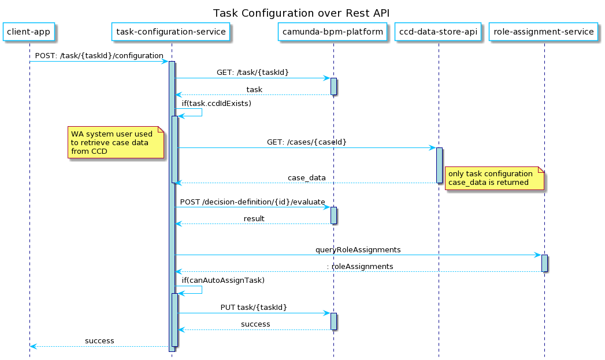

# wa-monitor-unconfigured-tasks-service

[](https://travis-ci.org/hmcts/spring-boot-template)

## Purpose

Task Monitor would use the Camunda Rest API to query for all Tasks that meet conditions that include:

* The Task level variable taskState is 'Unconfigured'
* Over a minimum age threshold

The latter condition would be set at 60 seconds to start with but can be adjusted as appropriate.  It should be set long enough so that we do not select any Tasks that are currently being Configured.  Note we also want to avoid picking up delayed Tasks which may be in the Unconfigured state but in the taskState variable is not at the Task scope.



Once the Tasks are returned the Configuration process for each one would be triggered by invoking the wa-task-configuration-service using the following endpoint: POST /task/{task-id}.

However, this would require a different approach to the one above whereby it can be done by simply providing the appropriate TaskId.  Task Configuration Service would then retrieve the Task from Camunda and update it over Rest.  The following diagram shows the process:



## Building and deploying the application

### Building the application

The project uses [Gradle](https://gradle.org) as a build tool. It already contains
`./gradlew` wrapper script, so there's no need to install gradle.

To build the project execute the following command:

```bash
  ./gradlew build
```

### Running the application

Create the image of the application by executing the following command:

```bash
  ./gradlew assemble
```

Create docker image:

```bash
  docker-compose build
```

Run the distribution (created in `build/install/spring-boot-template` directory)
by executing the following command:

```bash
  docker-compose up
```

This will start the API container exposing the application's port
(set to `4550` in this template app).

In order to test if the application is up, you can call its health endpoint:

```bash
  curl http://localhost:4550/health
```

You should get a response similar to this:

```
  {"status":"UP","diskSpace":{"status":"UP","total":249644974080,"free":137188298752,"threshold":10485760}}
```

### Alternative script to run application

To skip all the setting up and building, just execute the following command:

```bash
./bin/run-in-docker.sh
```

For more information:

```bash
./bin/run-in-docker.sh -h
```

Script includes bare minimum environment variables necessary to start api instance. Whenever any variable is changed or any other script regarding docker image/container build, the suggested way to ensure all is cleaned up properly is by this command:

```bash
docker-compose rm
```

It clears stopped containers correctly. Might consider removing clutter of images too, especially the ones fiddled with:

```bash
docker images

docker image rm <image-id>
```

There is no need to remove postgres and java or similar core images.

## License

This project is licensed under the MIT License - see the [LICENSE](LICENSE) file for details

