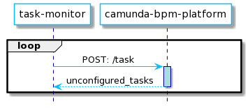
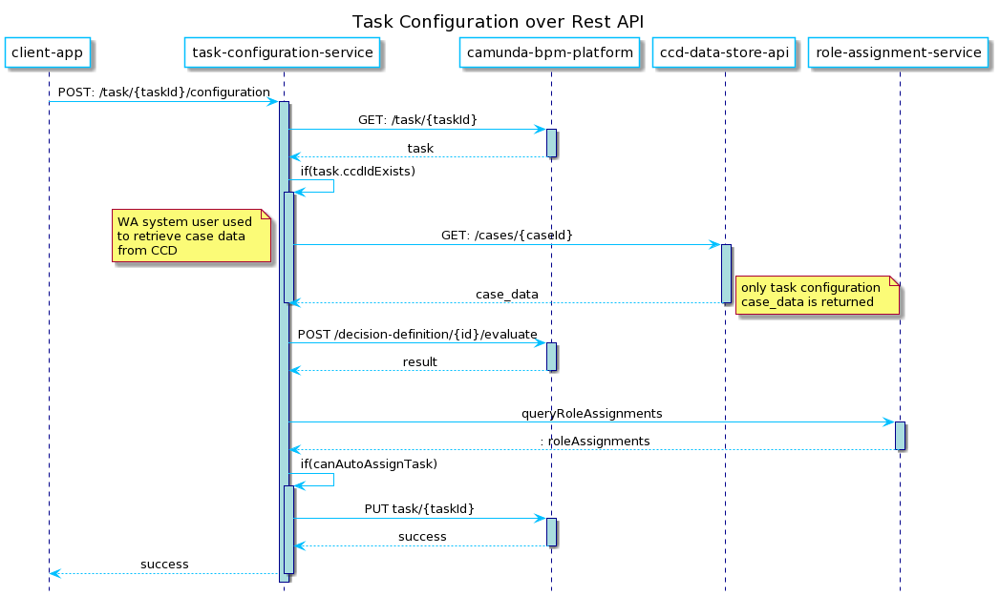

# wa-task-monitor

Last reviewed on: **15/04/2025**

[](https://travis-ci.org/hmcts/wa-task-monitor)

## Contents

- [Purpose](#purpose)
- [Prerequisites](#prerequisites)
- [Building and deploying the application](#building-and-deploying-the-application)
- [Running the application](#running-the-application)
- [Running contract or Pact tests](#running-contract-or-pact-tests)
- [Using Docker](#using-docker)
- [Alternative script to run application](#alternative-script-to-run-application)
- [License](#license)

## Purpose

The **wa-task-monitor** application interacts with the Camunda REST API to identify and process tasks that meet specific conditions, such as:

- The Task level variable taskState is 'Unconfigured'
- Over a minimum age threshold

The latter condition would be set at 60 seconds to start with but can be adjusted as appropriate. It should be set long
enough so that we do not select any Tasks that are currently being Configured. Note we also want to avoid picking up
delayed Tasks which may be in the Unconfigured state but in the taskState variable is not at the Task scope.



Once the Tasks are returned the Configuration process for each one would be triggered by invoking the
wa-task-management-service using the following endpoint: POST /task-configuration/{task-id}.

However, this would require a different approach to the one above whereby it can be done by simply providing the
appropriate TaskId. Task Management Service would then retrieve the Task from Camunda and update it over Rest. The
following diagram shows the process:



## Prerequisites

Ensure the following tools and dependencies are installed:

- **Java**: Version 11 or higher
- **Gradle**: Included via the `./gradlew` wrapper
- **Docker**: For containerization and running services
- **Minikube**: For local Kubernetes environment
- **Camunda REST API**: Accessible for task queries
- **wa-task-management-service**: Running and accessible

## Building and deploying the application

### Building the application

The project uses [Gradle](https://gradle.org) as a build tool. It already contains
`./gradlew` wrapper script, so there's no need to install gradle.

To build the project execute the following command:

```bash
  ./gradlew build
```

### Running the application

#### Prerequisite

* Minikube environment needs to up and running

```bash
./gradlew bootRun
```

#### Run Functional tests

Make sure `wa-workflow-api` and `wa_task_management_api` services are running, then execute:

    ./gradlew functional

### Running contract or pact tests:

You can run contract or pact tests as follows:

```bash
./gradlew contract
```

For example, to run the CCD consumer Pact tests for `wa_task_monitor` and `ccdDataStoreAPI_Cases` can be run with:

```bash
./gradlew contract --tests 'uk.gov.hmcts.reform.wataskmonitor.consumer.ccd.*'
```

To publish those tests to a local Pact Broker on `localhost:9292`, use the existing broker and branch variables:

- Start the Pact Broker using Docker Compose:

```bash
docker-compose -f docker-pactbroker-compose.yml up
```

- Run and publish the consumer Pacts using the `Dev` branch/tag:

```bash
PACT_BROKER_FULL_URL=http://localhost:9292 \
PACT_BRANCH_NAME=Dev \
./gradlew runAndPublishConsumerPactTests \
  --tests 'uk.gov.hmcts.reform.wataskmonitor.consumer.ccd.*'
```

The generated Pact files are written to `pacts/` and published as:

```
Consumer: wa_task_monitor
Provider: ccdDataStoreAPI_Cases
Broker:   http://localhost:9292
Branch:   Dev
```

#### Using docker

- Create the image of the application by executing the following command:

```bash
  ./gradlew assemble
```

- Create docker image:

```bash
  docker-compose build
```

Run the distribution (created in `build/install/wa-task-monitor` directory)
by executing the following command:

```bash
  docker-compose up
```

This will start the API container exposing the application's port
(set to `8077` in this template app).

In order to test if the application is up, you can call its health endpoint:

```bash
  curl http://localhost:8077/health
```

You should get a response similar to this:

```
  {"status":"UP","diskSpace":{"status":"UP","total":249644974080,"free":137188298752,"threshold":10485760}}
```

#### Alternative script to run application

To skip all the setting up and building, just execute the following command:

```bash
./bin/run-in-docker.sh
```

For more information:

```bash
./bin/run-in-docker.sh -h
```

Script includes bare minimum environment variables necessary to start api instance. Whenever any variable is changed or
any other script regarding docker image/container build, the suggested way to ensure all is cleaned up properly is by
this command:

```bash
docker-compose rm
```

It clears stopped containers correctly. Might consider removing clutter of images too, especially the ones fiddled with:

```bash
docker images

docker image rm <image-id>
```

There is no need to remove postgres and java or similar core images.

## License

This project is licensed under the MIT License - see the [LICENSE](LICENSE) file for details
